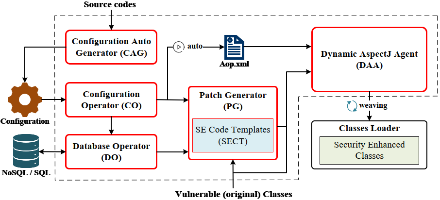
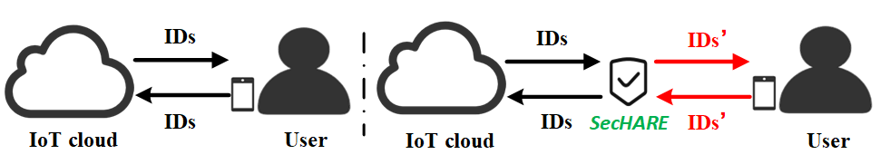
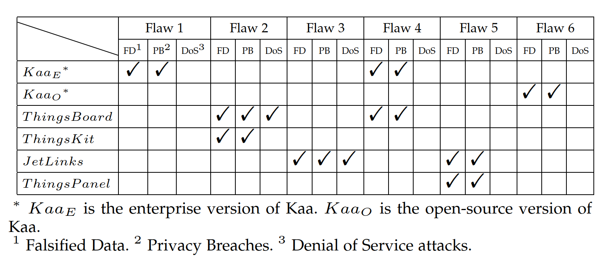

# SecHARE

*SecHARE*, a tool that automatically patches the vulnerable IoT clouds.


## Introduction

In the absence of security standards/guidance, today’s IoT clouds usually develop their homegrown mechanisms to support device sharing, resulting in heterogeneous and ad-hoc authorization-data management. In specific, we find IoT clouds use various types of data with different changeability as authorization-data. Moreover, due to the lack of understanding on the security implications of the authorization-data, today’s IoT clouds often adopt vulnerable authorization-data management mechanisms.

To mitigate such problems, we design and implement *SecHARE*, a tool that automatically patches the vulnerable IoT clouds. Specifically, *SecHARE* takes as input a *configuration* file that specifies the names of the sensitive methods operating the authorization-data (e.g., the *assignDeviceToCustomer()* function in ThingsBoard used to share a device to a delegatee user), automatically identifies such methods and inserts necessary operations into the bytecodes for security enhancement. Moreover, *SecHARE* implements an automatic configuration file generator to reduce the manual efforts needed to specify the configuration files. 

We applied *SecHARE* to 3 popular open-source IoT clouds, ThingsBoard, Kaa and JetLinks. Our
evaluation shows that *SecHARE* can effectively mitigate the authorization-data leakage flaws with negligible/acceptable overheads and can be easily deployed into today’s IoT ecosystem.

## Design



*SecHARE* is composed of 5 components: a Configuration Operator (**CO**), a Database Operator (**DO**), a Patch Generator (**PG**), a Dynamic AspectJ Agent (**DAA**), and a Configuration Automatic Generator (**CAG**). Essentially, *SecHARE* generates patches for the vulnerable cloud with the predefined Security Enhancement Code Templates (*SECT*) based on our usability preserving defense and leverages the AspectJ framework to insert these patches into the IoT cloud when the classes are loaded into the Java virtual machine.

Specifically, to apply *SecHARE* to patch an IoT cloud, we need to deploy and execute *SecHARE* along with the IoT cloud. Then, *CO* takes as input the *configuration* file (which specifies the methods/functions operating the authorization-data) to generate the *Aop.xml* file for the *DAA* to use. *CO* also outputs information (e.g., the specified authorization-data to protect and the names of methods need to be patched) to the *PG*. Along with the database operation APIs provided by *DO*, the *PG* then generates the patch codes. Taking as input the *Aop.xml* and the patch codes generated by *PG*, the *DAA* leverage the AspectJ framework to compile the patching codes and weave the additional/security-enhancement behaviors (defined by the patch codes) into the IoT cloud’s original vulnerable classes at loading time, allowing the IoT cloud to use Security Enhanced Classes to manage/operate the authorization-data.

## Result



The IoT clouds should ensure that the authorization-data transmitted in device sharing will not be leaked to attackers, preventing the unauthorized access to the devices from the attackers. 

Without *SecHARE*, the actual authorization-data (e.g., IDs) is transmitted to the delegatee user during device sharing, which could lead to some problems. 

In contrast, *SecHARE* works as a proxy during authorization-data transmission, hiding the actual authorization-data to secure it.

## Usage

1. Add SecHARE dependencies to the `pom.xml` file

   ```xml
   <dependency>
       <groupId>org.example</groupId>
       <artifactId>SecHARE</artifactId>
       <version>xx-SNAPSHOT</version>
   </dependency>
   ```

2. Add just one line of code to the Java program's startup class

```java
SecHARETool.init();
```

3. Add the configuration file `privacyconfig.properties` or run the configuration file  auto-generator (in "*SecHARE/src/main/java/org.example/gen/*").


# Flaws



We have identified 6 authorization-data leakage flaws in the evaluated IoT clouds. Leveraging these
flaws, attackers can use the leaked authorization-data to emulate the victim devices for device state and event forgery attacks (e.g., a fake alarm event), privacy theft attacks (e.g., inferring the absence/presence of the victim via obtaining the state of the victim’s devices) and deny of service (DoS) attacks (e.g., disconnecting a sub-device). We summarize the severe consequences of these attacks as falsified data (FD), privacy breach (PB) and deny of service (DoS). Moreover, we found the flaws identified could expose a large number of IoT users and other IoT clouds, as well as organizations, and vendors in various fields, to security risks.

The "*flaws_PoC_attack_programs*" folder contains the program code for the PoC of the 6 flaws


## Publications

If you want to know more detailed information, please refer to this paper: 

Bin Yuan, Maogen Yang, Zhen Xu, Qunjinming Chen, Zhanxiang Song, Zhen Li, Deqing Zou, Hai Jin. Leakage of Authorization-Data in IoT Device Sharing: New Attacks and Countermeasure. IEEE Transactions on Dependable and Secure Computing, 2023.